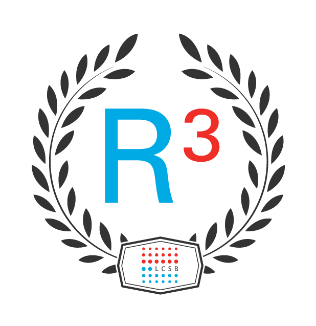

# Basic git course - Practice repository

## How to get started?

- Fork this repository by clicking on the `Fork` button on the top right of this page.
- Clone your forked repository to your local computer.

:warning: **Make sure that you have your SSH key and `git` properly configured**.

```bash
$ git clone git@github.com:<yourName>/basic-git-practice.git
```

## Create your own branch

The development scheme is based on a stable `master` branch and a development branch named `develop`.

Before making changes, create your own branch from `develop`:
```bash
$ cd basic-git-practice
$ git checkout develop # this switches the branch to develop
$ git checkout -b myBranch # this checks out a new branch called myBranch
```

## Make your changes

Copy the file `template.md` in the folder `_attendees` and rename it with your firstname:

```bash
$ cd _attendees
$ cp template.md myName.md
```

Then, make your changes with your favorite editor!

## Commit your changes and push

When you are done editing your file, add the file to the stage and commit it:
```bash
$ git add myName.md
$ git commit -m "Edite the content of the subpage myName.md"
```

Once you are done committing, you can push your branch to your fork:
```
$ git push origin myBranch
```

## Open a pull-request

If you now browse to your fork on Github, you can open a pull request and submit it for review.

:warning: Watch out for comments from the reviewer! If there are things to be chaned, simply change locally, commit,
and then push again. The pull-request will update automatically.

Once the pull request has been accepted, you will be able to see your page online! :tada:
